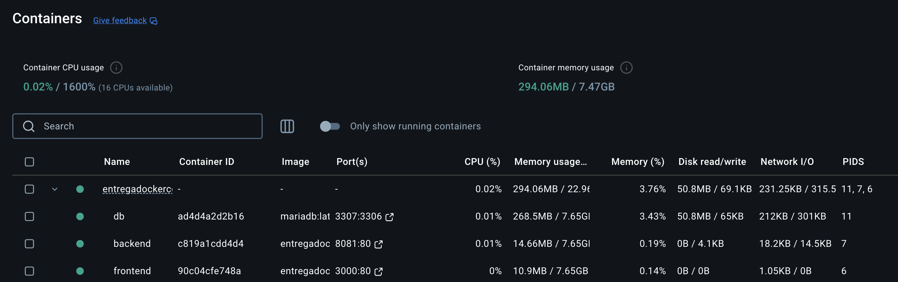

# APLICACIONES MULTICAPA - JONATAN RAMÍREZ MORAGA


Debemos lanzar 3 contenedores, separando el front, back, y la base de datos:


**FRONT:**
Contenedor que debe de tener una estructura html, y el código javascript recoger los datos de html,
y enviarlos mediante una llamada ayax a la api de PHP, que los procesará.

**BACK:**
Contenedor que al ser lanzado debe descargar la imagen de php con apache, y PDO para poder hablar con la base de datos.

**BD:**
Contenedor con la imagen de mariaDb en el que tendremos nuestra base de datos para recoger lo enviado a traves de ayax y php.

<br>


>En primer lugar crearemos nuestro repositorio donde alojar el código, en github. Una vez creado traeremos el proyecto a nuestro ordenador mediante el comando git clone, y tras clonarlo iniciarémos git flow.


<h3>Instalar composer en nuestro proyeco</h3>
<p>Para poder usar composer debemos instalarlo en nuestro proyecto, para ello abrimos nuestro terminal y escribimos:<br></p>

```bash
composer init
```


<h3>Creación de la estructura del proyecto</h3>

Creamos los direcctorios donde guardaremos nuestras imágenes, y dentro de ella los archivos de configuración de cada una de las imágenes, separando en carpetas distintas el front, back, y la base de datos.


En la raiz de la carpeta tenemos el archivo docker-compose.yml, que es el archivo que lanzaremos para levantar nuestro proyecto.
Tiene que seguir la siguiente estructura:
<br>
<br>
>Este es un ejemplo de un archivo docker-compose.yml.


<p>1.En <strong>versión</strong> indicamos la versión de composer que usaremos.</p>

<p>2.Dentro de <strong>Services</strong> será donde indicaremos los contenedores que vamos a lanzar.</p>

<p>3.Dentro de <strong>build</strong> esta el context donde indicamos donde encontraremos el archivo dockerfile, en este caso el dockerfile que se encuentra en la carpeta front.</p>

<p>4.En <strong>container_name</strong> indicamos el nombre del contenedor, en este caso el front.</p>

<p>5.En <strong>ports</strong> establecemos los puertos que abriremos en el contenedor, en este caso abriremos el puerto 8080 para acceder al front, y el 8081 para el back.

<p>6.En <strong>depends_on</strong> decimos que contenedor deben listos antes de lanzar el front, en este caso el back. Y el back depende de la base de datos.</p>

<p>7.En <strong>networks</strong> establecemos las redes que usaremos, si usamos una personalida, en este caso la red my_network que se creará en el archivo docker-compose.yml.</p>

<p>8.En <strong>volumes</strong> establecemos los volumenes que usaremos, en este caso el volumen ./front:/var/www/html que indica que el contenedor front usará el directorio front< como volumen.</p>

<p>9.En <strong>environment</strong> establecemos las variables de entorno que usaremos, en este caso la variable de entorno de la base de datos que se creará en el archivo docker-compose.yml.</p>


<h3>Creación de la imagen de php</h3>

<p>Creamos un archivo dockerfile en la carpeta back, y dentro de este archivo escribimos lo siguiente:</p>


Le estamos indicando que el contenedor usará la imagen oficial de PHP con Apache, y que el directorio de trabajo será el /var/www/html, y que instalaremos las extensiones necesarias para PHP (PDO y MySQL).

Además, le estamos indicando que el puerto 80 de Apache debe ser expuesto.

<h3>Lanzamiento del proyecto</h3>

<p>Para lanzar el proyecto debemos ejecutar el comando docker-compose up --build -d en la raíz del proyecot. Este comando levantará todos los contenedores que hemos creado en el archivo docker-compose.yml, y construirá las imágenes si no existen, y levantará los contenedores.</p>

```bash
docker-compose up --build -d
```

Si todo está correcto, deberíamos ver un mensaje de éxito indicando que todos los contenedores se están levantando.


Y nos aparecerán activos en Docker Desktop.




Teniendo correctamente conectado front, back, y la base de datos, y cada uno en un contenedor. Podremos usar nuestro front como formulario de login, y nuestro back como api de php. Haremos una llamada ajax al servidor para obtener los usuarios y mostrarlos en nuestro front.


